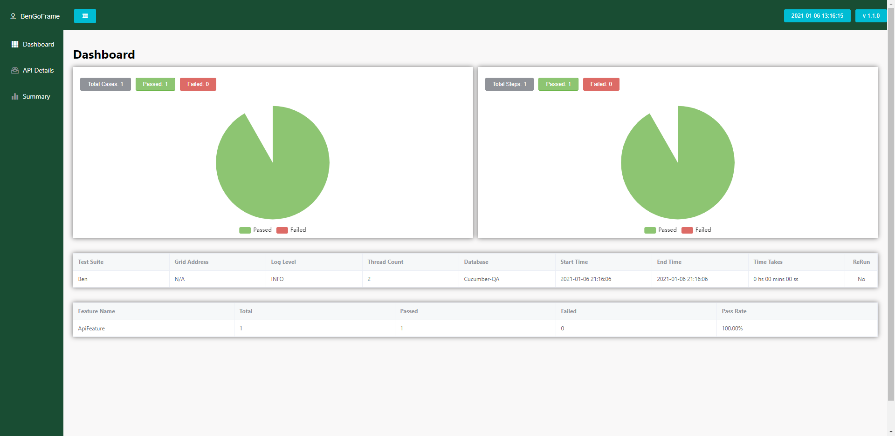
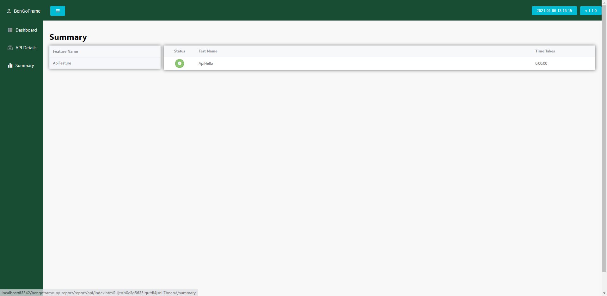

# BenGoFrame Python Report


BenGoFrame Python Report is created for the automation test

You can log the test details for the test steps so that you can check the details in the report

This report will not create html by code

Just generate test data details and modify to index.html in template folder 

Please do not delete or modify the fields in template folder

Pre-views examples:






Installation: 

```python
# Use pipenv to install Pipfile
# pipenv install --skip-lock
[packages]
beautifulsoup4 = "*"
lxml = "*"

# If you have no pipenv. 
# Please copy them to requirenments.txt and pip install -r requirenments.txt

# Please use python 3.8 to run the example.py
# If you want to create your own creator and appender. Do not use example.py to show the test report
[requires]
python_version = "3.8"
```

`testData.json` is the copy file to display all test results

If you don't know what the values should be. Please input the "" into the values 

For more details. Please read the `src/report_creator.py` and `src/tests_appender.py`

Please note that you can modify the `src/report_creator.py` and `src/tests_appender.py` or create `src/report_creator.py` and `src/tests_appender.py` by your logical working flows. But you can't modify the formatted JSON below keys, it means that you have to follow below format to generate the JSON file. Also please follow the `src/report_creator.py func _modifyhtml()` to set the testData.json into the index.html.

```json
# Example: testData.json 
{
	"testConfig": {
    "testSuite": "Ben",
    "gridAddress": "http://localhost:4444/wd/hub",
    "logLevel": "INFO",
    "threadCount": "2",
    "database": "Cucumber-QA",
    "reRun": "No",
    "startTime": "2020-04-02 21:31:47",
    "endTime": "2020-04-02 21:31:47",
    "takeTimes": "0 hs 00 mins 00 ss"
  },
  "casesChart": {
    "totalCases": 0,
    "passed": 0,
    "failed": 0
  },
  "stepsChart": {
    "totalSteps": 0,
    "passed": 0,
    "failed": 0
  },
  "featureSummary": [
    {
      "total": "0",
      "passed": "0",
      "failed": "0",
      "featureName": "MyFeature",
      "passRate": "{passed/total %}"
    },
    {
      "total": "0",
      "passed": "0",
      "failed": "0",
      "featureName": "MyFeature2",
      "passRate": "{passed/total %}"
    }
  ],
  "testDetails": [
    {
      "testName": "Hello",
      "featureName": "MyFeature",
      "status": "failed",
      "datas": {
        "name": "selenium"
      },
      "timeTakes": "0:00:00",
      "steps": [
        {
          "stepDescription": "This is for test",
          "stepStatus": "failed",
          "data": "selenium",
          "findBy": "xpath=id",
          "stepDetails": "details",
          "screenShot": ""
        },
        {
          "stepDescription": "This is for test",
          "stepStatus": "passed",
          "data": "selenium",
          "findBy": "xpath=id",
          "stepDetails": "details",
          "screenShot": ""
        }
      ]
    },
    {
      "testName": "Hello2",
      "featureName": "MyFeature2",
      "status": "passed",
      "datas": {
        "name": "selenium2"
      },
      "timeTakes": "0:00:00",
      "steps": [
        {
          "stepDescription": "This is for test2",
          "stepStatus": "passed",
          "data": "selenium2",
          "findBy": "xpath=id",
          "stepDetails": "details2",
          "screenShot": ""
        },
        {
          "stepDescription": "This is for test2",
          "stepStatus": "passed",
          "data": "selenium2",
          "findBy": "xpath=id",
          "stepDetails": "details2",
          "screenShot": ""
        }
      ]
    }
  ]
}
```

Screenshot:

if your test step has screenshots. Please save them to a specify folder and name the screenshot file by a unique name for each. And then append the name into the test step.

```json
# testData.json screenshot examples:
"steps": [
    {
          "stepDescription": "This is for test2",
          "stepStatus": "passed",
          "data": "selenium2",
          "findBy": "xpath=id",
          "stepDetails": "details2",
          "screenShot": "{screenshot_name.png}"
     }
	]
# Do not give a full path to the name. Just give it to file_name.png
# When you saved all screenshot file into a specify folder. 
# Please call the ReportCreator.completed({your screenshot folder})
# It will copy and rename to the output_report/static/imgs
```

If you don't have screenshot.  Just let it go.

